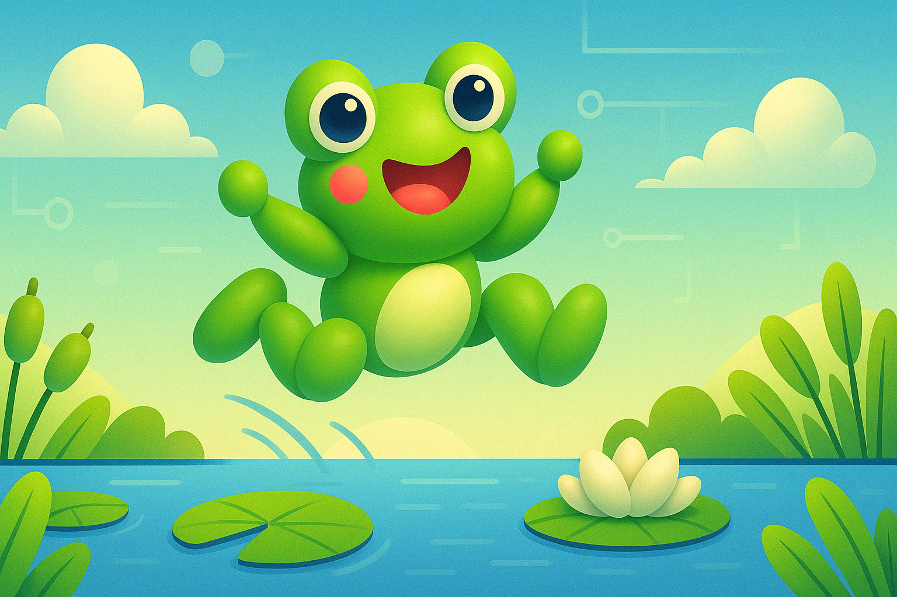
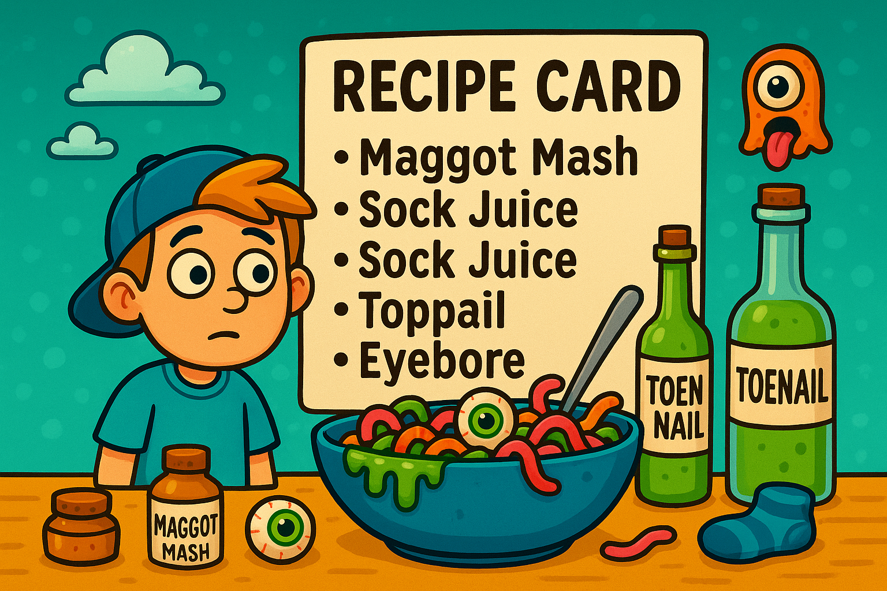
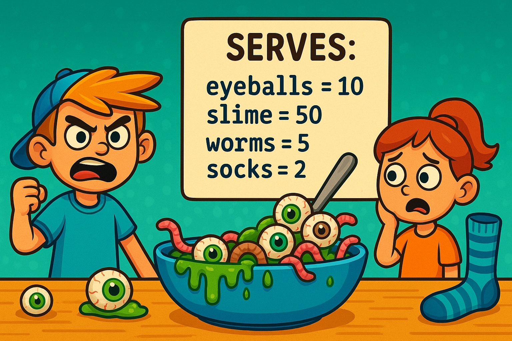
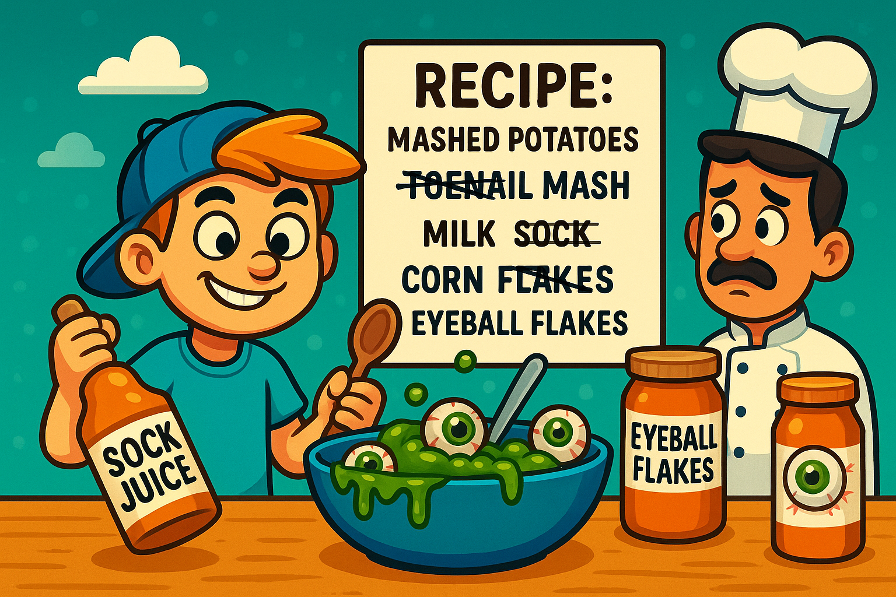

## Python Bytes

A collection of short Python activities designed to be complete in 10 minutes to half-an-hour.

  <!-- Image 1 -->
  

    
    

      
A bold recipe with eyeballs, slime, worms, and socks—gross and mysterious!

    

  

  <!-- Image 2 -->
  

    
    

      
Chef is appalled while the kid proudly serves a horror bowl of gunk and eyeballs.

    

  

  <!-- Image 3 -->
  

    
    

      
Wild recipe card with maggot mash, sock juice, and rainbow chaos.

    

  

  <!-- Image 4 -->
  

    
    

      
Now featuring the confused boy—same gross ingredients, unified design!

    

  

  <!-- Image 5 -->
  

    
    

      
The boy is puzzled by the disgusting dish he may have to eat.

    

  

  <!-- Image 6 -->
  

    
    

      
He’s up to no good—replacing normal ingredients with eyeball flakes and sock juice!

    

  

