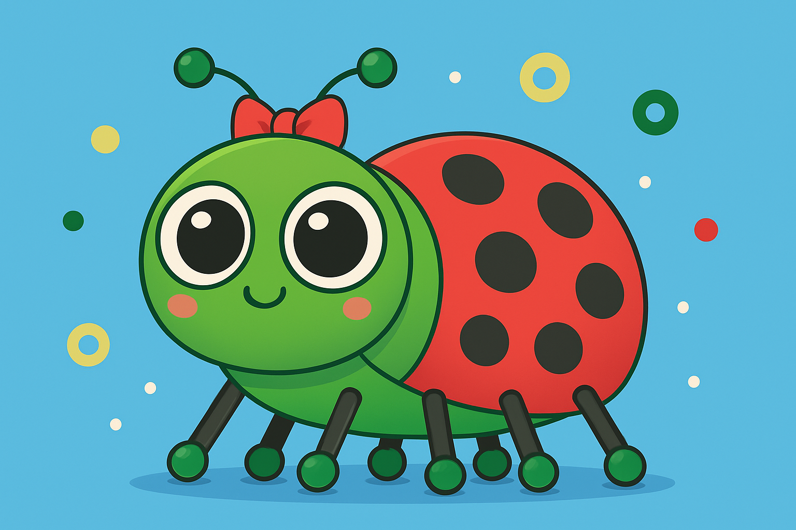
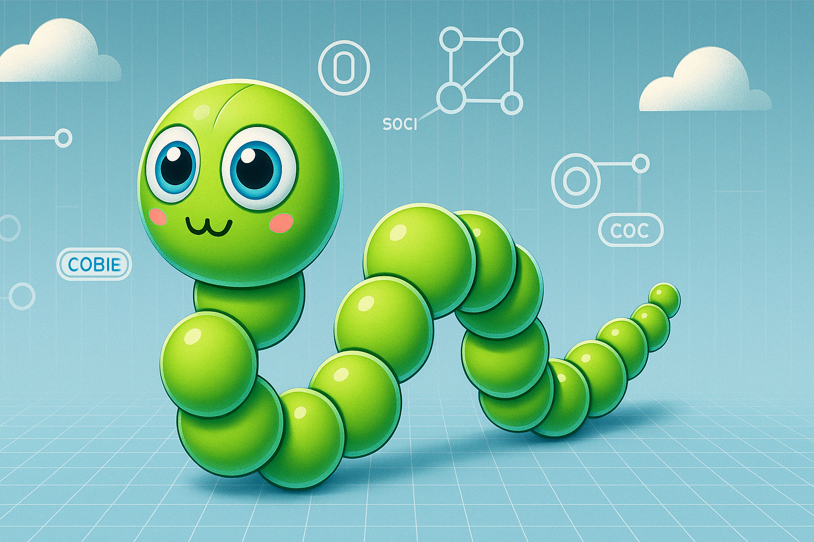

## Python Bytes

A collection of short Python activities designed to be complete in 10 minutes to half-an-hour.

<html>
<head>
  <meta name="viewport" content="width=device-width, initial-scale=1">
</head>
<body>

  <!-- Shared style note:
       Each block below uses flex-wrap so the image and text stack on small screens -->
  
  <!-- Disgusting Dishes -->
  

    
    

      
Use <code>print()</code> and <code>f-strings</code> to build a horrible recipe card. Add emojis and control spacing with <code>sep=</code> and <code>end=</code>. Visit <a href="https://rpf.io/disgusting" target="_blank">rpf.io/disgusting</a>

    

  

  <!-- Gross Groceries -->
  

    
    

      
Use variables and <code>f-strings</code> to list ingredient quantities. Build up a weird and wonderful recipe from scratch. Visit <a href="https://rpf.io/gross" target="_blank">rpf.io/gross</a>

    

  

  <!-- Recipe Wreckers -->
  

    
    

      
Wreck a lovely recipe by replacing ingredients with horrible ones using string methods. Practice <code>.replace()</code> and <code>.upper()</code> for creative output. Visit <a href="https://rpf.io/wreckers" target="_blank">rpf.io/wreckers</a>

    

  

  <!-- Dot the Bug -->
  

    
    

      
Draw a bug using simple shapes in Python with p5. Learn how to position and layer shapes with symmetry. Visit <a href="https://rpf.io/dot" target="_blank">rpf.io/dot</a>

    

  

  <!-- Wiggle the Snake -->
  

    
    

      
Create a wiggly snake animation using loops and position changes. Explore how to animate simple movement in p5. Visit <a href="https://rpf.io/wiggle" target="_blank">rpf.io/wiggle</a>

    

  

  <!-- Hop the Frog -->
  

    
    

      
Animate a jumping frog that stretches and squashes with code. Use variables to control how its body parts move. Visit <a href="https://rpf.io/hop" target="_blank">rpf.io/hop</a>

    

  

</body>
</html>
